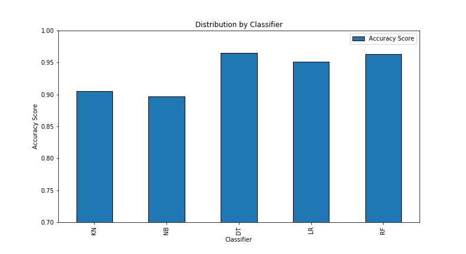

# SMS_Spam_prediction
Predicting if the SMS is spam or not using Classification Algorithms

# Problem Statement & Goal

The number of Spam messages that we receive on our phones have been increasing rapidly. This leads to wastage of time, money and energy by going through such messages.

To prevent such spam messages, we are going to classify the messages as spam or not spam(ham) using known history of sms data. This will help us avoid such spam messages showing up on our phones.

# About the dataset

The SMS Spam Collection is a set of SMS tagged messages that have been collected for SMS Spam research. It contains one set of SMS messages in English of 5,574 messages, tagged acording being ham (legitimate) or spam.

The dataset was downloaded from Kaggle. (https://www.kaggle.com/uciml/sms-spam-collection-dataset)

Target variable is label and its categories are:

ham  - 0

spam - 1

# Conclusions

The model we chose is Random Forest with Feature engineering.

Our model is classifying the not spam messages very well but makes some misclassification in the spam messages.

We have to control our recall for spam category which will help improve the model performance.

Overall it is a decent model with good prediction power.

# Future work

1.Improve the model by controlling recall.

2.Creating a website to check if the message is spam or not.
